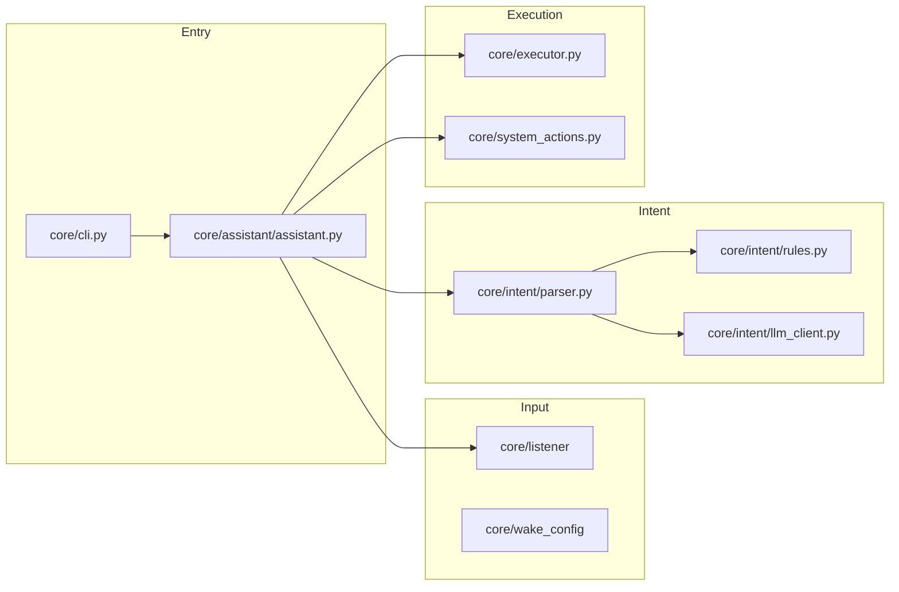

# Contributing to Dora

## Architecture



Mixins implement `AssistantHost` (`core/assistant/protocol.py`):

| Mixin | Role |
|-------|------|
| `StartupMixin` | Models, mic, LLM warmup |
| `InputMixin` | Wake word + listen loop |
| `DispatchMixin` | Intent → action |
| `OverlayMixin` | Tk status card |

## Development setup

```powershell
git clone https://github.com/forexlord/dora.git
cd dora
py -3.12 -m venv venv
.\venv\Scripts\Activate.ps1
pip install -e ".[dev]"
$env:DORA_HOME = (Get-Location).Path
python scripts\first_run_setup.py
pytest
ruff check core tests
mypy core
```

Optional Whisper STT:

```powershell
pip install -e ".[whisper]"
```

Set `"stt_engine": "whisper"` in `config.json`.

## Configuration

All settings live in `DoraConfig` (`core/config.py`). Unknown keys in `config.json` are logged and ignored. Invalid values raise `ConfigValidationError` at startup.

Legacy `ollama_*` keys are migrated automatically.

## Permissions

- `permissions.json` is created automatically (empty `{}`).
- Default `trust_mapped_apps: false` requires a one-time voice confirmation per app; choices persist in `permissions.json`.
- Set `trust_mapped_apps: true` to auto-allow apps found in the Windows launch index (convenience over strictness).
- See `permissions.json.example` for the format.

## Pull requests

1. Add or update tests in `tests/` for behavior changes.
2. Run `pytest` and `ruff check core tests`.
3. Keep Windows-only paths behind `core/platform_check.require_windows()` or `sys.platform` checks.
